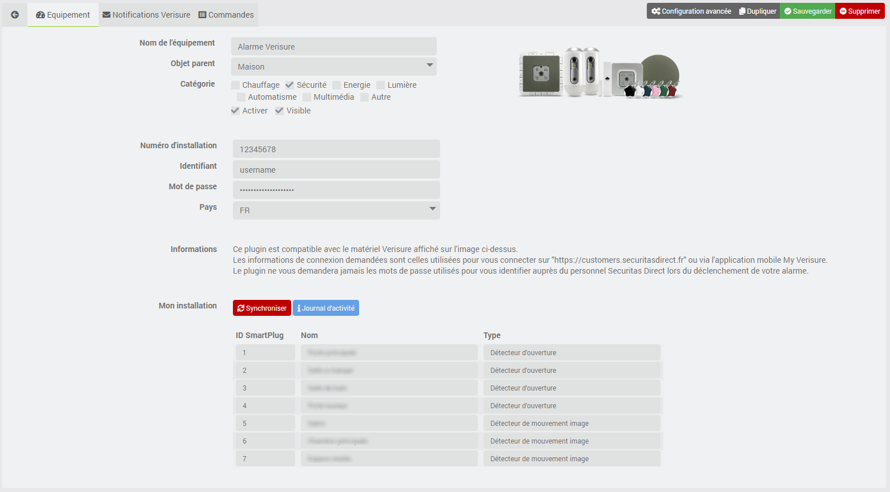

# Présentation 

Ce plugin Jeedom vous permet d'interagir avec votre alarme Verisure Europe (Securitas Direct) au même titre que l'application officielle "My Verisure".
Il est compatible avec les alarmes Verisure de dernière génération :

**NOTE : CE PLUGIN N'EST EN AUCUN CAS ASSOCIÉ OU LIÉ AUX SOCIÉTÉS DU GROUPE SECURITAS DIRECT - VERISURE.**

L'usage de ce plugin est destiné à des fins strictement personnelles et privées.
Par conséquent, le développeur n'approuve ni ne tolère aucune utilisation inappropriée, et n'assume aucune responsabilité légale pour la fonctionnalité ou la sécurité de vos alarmes et appareils.

# Principe 

Ce plugin interagit avec les API Verisure au travers du cloud, par conséquent **ce plugin nécessite une connexion Internet**.
 
Il faut également détenir un abonnement aux services Verisure. En effet, ce plugin ne dialogue avec la base de votre alarme qu'au travers de leurs infrastructures cloud. Il n'interagit pas directement avec la base, ni avec les smartplugs associés. Si votre abonnement a été résilié, ce plugin ne fonctionnera pas.

# Configuration du plugin

Après téléchargement du plugin, il vous suffit juste d’activer celui-ci, il n’y a aucune configuration supplémentaire à ce niveau.

> **Tip**
>
> Pour faciliter une demande d'aide à distance, il est conseillé de régler les logs en **mode debug**. 

# Ajout d'une alarme

La configuration des équipements Alarme est accessible à partir du menu Plugin > Sécurité.

Cliquez sur la commande Ajouter pour créer une nouvelle alarme. Une fois ajoutée vous vous retrouvez avec :

-   **Nom de l’équipement** : nom de votre alarme

-   **Objet parent** : indique l’objet parent auquel appartient l’équipement

-   **Catégorie** : la catégorie de l’équipement (sécurité en général pour une alarme)

-   **Activer** : permet de rendre votre équipement actif

-   **Visible** : rend votre équipement visible sur le dashboard

-   **Numéro d'installation** : indiquez votre numéro d'installation Vérisure

-   **Identifiant** : indiquez votre identifiant Verisure que vous utilisez pour vous connecter sur le site : [https://customers.securitasdirect.fr](https://customers.securitasdirect.fr)

-   **Mot de passe** : indiquez votre mot de passe

-   **Pays** : choisissez le pays dans lequel est installée votre alarme (pays supporté à ce jour : France, Espagne, Grande Bretagne, Italie, Portugal)

Il vous suffit ensuite de cliquer sur le bouton **Synchroniser** pour récupérer les informations de votre alarme. Si tout se passe bien, vous obtiendrez un tableau reprenant l'ensemble des smartplugs installés à votre domicile (ID, nom et type).

> **Tip**
>
> N'oubliez pas de **sauvegarder** vos informations !
>
> Lors de la sauvegarde, de nouvelles commandes vont se créer sur l'équipement.

# Commandes

Il existe actuellement plusieurs commandes qui sont décrites ci-dessous.

> **Tip**
>
> Les commandes ont été créées de manière à être compatibles avec le plugin [Homebridge](https://www.jeedom.com/market/index.php?v=d&p=market&author=Nebz&&name=Homebridge) de Nebz !

## Info

-   **Etat Activation** : permet de connaitre l'état d'activation de l'alarme
	- **0** : désarmée
	- **1** : armée

-   **Etat Alarme** : permet de connaitre l'état de l'alarme
	- **0** : état normal
	- **1** : alarme déclenchée

-   **Mode Alarme** : permet de connaitre le mode d'activation de l'alarme
	- **Mode total** : l'alarme est activée en mode total
	- **Mode nuit** : l'alarme est activée en mode nuit
	- **Mode jour** : l'alarme est activée en mode jour

D'autres modes suivront dans les futures versions du plugin.

**Attention** : dans cette première version, l'évènement lié au déclenchement de l'alarme n'est pas encore pris en compte !
	

## Action

-   **Mode Total** : active l'alarme en mode total

-   **Mode Nuit** : active l'alarme en mode nuit

-   **Mode Jour** : active l'alarme en mode jour

-   **Désactivation** : désactive de l'alarme, quel que soit le mode

-   **Statut Alarme** : met à jour du statut de l'Alarme

# Dashboard

Le plugin inclus un dashboard qui permet de :
-   Connaitre le statut de l'alarme
-   Connaitre l'état de l'alarme
-   Connaitre le mode e l'alarme
-   Activer le mode total de l'alarme
-   Activer le mode nuit de l'alarme
-   Activer le mode jour de l'alarme
-   Désactiver l'alarme
-   Mettre à jour le statut de l'alarme

**Attention** : les commandes peuvent parfois mettre plusieurs secondes à se réaliser (entre 15s et 25s). Cela est lié à la qualité de connexion 3G ou 4G de la base de votre alarme. Alors soyez patient !

# Rafraichissement

## Automatique

Un CRON est automatiquement créé sur base de 30 min comme indiqué dans la configuration du plugin.

**Attention** : cette valeur de 30 min pourra être amenée à évoluer en fonction du retour et des demandes des utilisateurs ainsi que du nombre de requêtes autorisées par heure par Verisure sur leurs serveurs !

## Manuel

Vous pouvez à tout moment utiliser la commande **Statut Alarme** afin de rafraichir le statut de l'alarme.

# Roadmap

Ce plugin évoluera au fil du temps en fonction de vos demandes et des possibilités des API Versiure.

Les prochaines versions verront arriver les features suivantes :

-   Gestion du déclenchement de l'alarme (sur utilisation de reception d'e-mail ?)
-   Récupération des photos des détecteurs de mouvement image 
-   Ajout du mode Extérieur (si demandé) 
-   Récupération du journal des évènements liés à votre alarme

> **Tip**
>
>Vous pouvez faire votre demande par en créant une demande "enhancement" [GitHub](https://github.com/Xav-74/verisure/issues/new).
>
>N'hésitez pas non plus à venir échanger sur ce plugin sur le forum Jeedom !